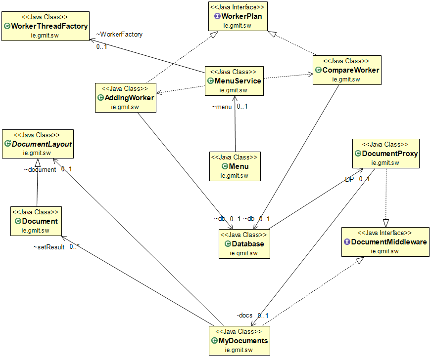

# Application-for-Measuring-Document-Similarity
 Java web application that enables two or more text documents to be compared for similarity. It is a project for the module Advance Object Orientated Programming.

### Technologies:

- Maven
- Tomcat 7
- db4o

